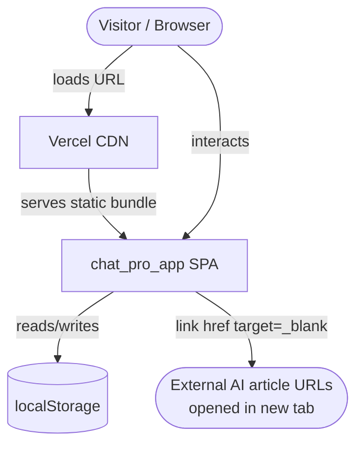
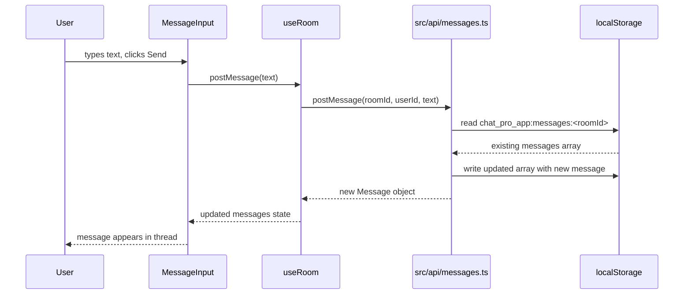
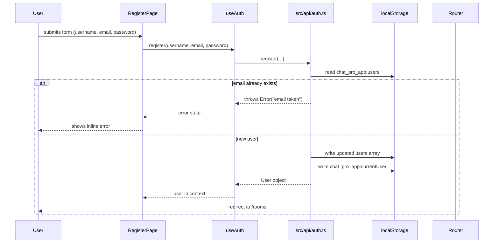
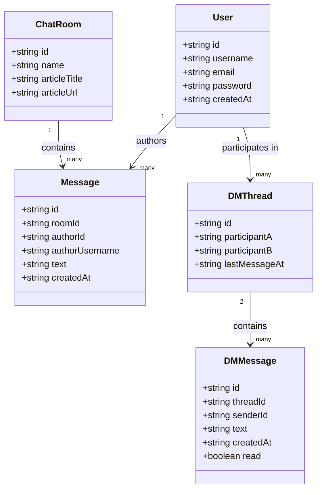

# Architecture — chat_pro_app

## 1. Overview

chat_pro_app is a client-side React 19 + TypeScript single-page application
that lets users register instantly, join AI-article-linked discussion rooms,
and send direct messages to other registered users. All persistence is handled
via localStorage — there is no backend, no server, and no network requests.
The solution type is **MVP**: first shippable version for early users, with a
clean public deployment via Vercel.

---

## 2. Solution type and scope

**Type:** MVP

**In scope:**

- User registration (username + email + password) and login; no email
  confirmation step.
- Auth state persisted in localStorage; survives page reload.
- Pre-seeded chat rooms (at least 5), each linked to an AI article (title +
  URL).
- Per-room message threads persisted in localStorage.
- Direct messaging between any two registered users; DM threads persisted in
  localStorage.
- Unread-message indicator on DM thread list entries.
- Client-side routing via React Router v6.
- Vercel deployment as a static SPA.

**Out of scope:**

- Any server-side component, REST API, or WebSocket layer.
- Email confirmation or password reset flows.
- Real-time message push (no polling, no WebSockets).
- User profile editing or avatar upload.
- Room creation by users (rooms are pre-seeded only).
- Message deletion or editing.
- Search across rooms or messages.
- Pagination or infinite scroll.
- Admin or moderation tooling.
- Native mobile / PWA features.

**Assumptions:**

- A single browser session is the only supported concurrent-use scenario;
  multi-tab sync via `storage` events is not required for MVP.
- Password is stored as-is in localStorage (no hashing). This is acceptable
  for a demo MVP with no real user data sensitivity, and must be documented as
  a known limitation.
- "Registered users" visible for DM selection are all users stored in the
  `chat_pro_app:users` localStorage key.
- The seed rooms are hard-coded in `src/api/rooms.ts` and inserted once into
  localStorage on first load.

---

## 3. Functional requirements

Traceable to `feature_list.json` IDs.

**FAUTH**

- FR-1: A visitor can register with username, email, and password. Duplicate
  email addresses are rejected.
- FR-2: A registered user can log in with email + password.
- FR-3: Auth state (current user) persists across page reloads.
- FR-4: The navbar displays the current user's username when logged in.
- FR-5: Logout clears auth state and redirects to `/login`.
- FR-6: Protected routes redirect unauthenticated visitors to `/login`.

**FCHAT**

- FR-7: The rooms list page (`/rooms`) shows all pre-seeded rooms with their
  name and linked article title.
- FR-8: Opening a room (`/rooms/:id`) shows the article link and the full
  message thread for that room.
- FR-9: Authenticated users can post a new message to a room.
- FR-10: Room messages persist in localStorage and survive page reload.
- FR-11: At least 5 rooms are pre-seeded, each with a distinct AI article
  title + URL.

**FDM**

- FR-12: The DM list page (`/dm`) shows all conversation threads the current
  user participates in.
- FR-13: The user can start a new DM conversation by selecting any other
  registered user.
- FR-14: Opening a DM thread (`/dm/:userId`) shows the full message history
  with that user.
- FR-15: The user can send a message in a DM thread.
- FR-16: DM messages persist in localStorage and survive page reload.
- FR-17: The DM list shows an unread indicator on threads that contain
  messages the current user has not yet viewed.

---

## 4. Non-functional requirements

| Attribute       | Target                                      | Rationale                                             | Priority |
| --------------- | ------------------------------------------- | ----------------------------------------------------- | -------- |
| Performance     | Initial load < 3 s on a mid-range device    | SPA with no network data; Vite bundle is small        | must     |
| Availability    | Static Vercel deployment; 99.9 % uptime     | No server to go down                                  | must     |
| Security        | No passwords sent over the wire; plain-text | MVP demo; document as known limitation                | should   |
| Observability   | `npm run lint` + `npm run typecheck` pass   | No runtime monitoring needed for client-only MVP      | must     |
| Maintainability | Test coverage: at least one test per module | Vitest + React Testing Library; init.sh enforces this | must     |
| Accessibility   | Semantic HTML; keyboard-navigable forms     | Follows existing conventions.md                       | should   |

---

## 5. System context



---

## 6. Component breakdown

### Source layout

```
src/
  api/
    auth.ts         — register, login, logout, getCurrentUser; reads/writes localStorage
    rooms.ts        — getRooms, getRoomById, seed rooms on first load; reads/writes localStorage
    messages.ts     — getMessages, postMessage for a given roomId; reads/writes localStorage
    dm.ts           — getDMThreads, getDMMessages, sendDM, markRead; reads/writes localStorage
  hooks/
    useAuth.ts      — consumes AuthContext; exposes { user, login, register, logout }
    useRooms.ts     — loads room list; returns { rooms, loading }
    useRoom.ts      — loads single room + messages; returns { room, messages, postMessage }
    useDM.ts        — loads DM threads for current user; returns { threads, startThread }
    useDMThread.ts  — loads one DM thread; returns { messages, send, markRead }
  context/
    AuthContext.tsx  — React Context + Provider for current auth state
  components/
    Navbar.tsx          — top navigation bar; shows username + logout when authenticated
    ProtectedRoute.tsx  — wrapper that redirects to /login if no user in context
    RoomCard.tsx        — single room entry in the list (name + article title)
    MessageList.tsx     — scrollable list of Message items
    MessageInput.tsx    — controlled textarea + send button
    UserSelector.tsx    — dropdown to pick a registered user for a new DM
    DMThreadItem.tsx    — single DM thread entry with unread badge
  pages/
    RegisterPage.tsx    — /register — registration form
    LoginPage.tsx       — /login — login form
    RoomsPage.tsx       — /rooms — room list
    RoomPage.tsx        — /rooms/:id — room + message thread
    DMListPage.tsx      — /dm — DM conversation list
    DMPage.tsx          — /dm/:userId — single DM thread
  types/
    index.ts            — User, ChatRoom, Message, DMThread, DMMessage type definitions
  theme/
    tokens.css          — generated by designer; never hand-edited
  main.tsx              — app entry point; renders <App /> inside <AuthProvider>
  App.tsx               — router setup
```

### Critical path: posting a room message



### Critical path: auth (register + protected route)



---

## 7. Data model



### localStorage schema

| Key                                   | Type           | Contents                                      |
| ------------------------------------- | -------------- | --------------------------------------------- |
| `chat_pro_app:users`                  | `User[]`       | All registered users                          |
| `chat_pro_app:currentUser`            | `User \| null` | Logged-in user; null when logged out          |
| `chat_pro_app:rooms`                  | `ChatRoom[]`   | Pre-seeded rooms (written once on first load) |
| `chat_pro_app:messages:<roomId>`      | `Message[]`    | All messages for a specific room              |
| `chat_pro_app:dm:threads`             | `DMThread[]`   | All DM thread metadata                        |
| `chat_pro_app:dm:messages:<threadId>` | `DMMessage[]`  | All messages for a specific DM thread         |

All values are JSON-serialized. Every `api/` function reads, mutates, and writes
back the relevant key atomically within a single synchronous call.

---

## 8. Technology decisions

| Decision      | Chosen option                             | Alternatives considered              | Rationale                                                                        |
| ------------- | ----------------------------------------- | ------------------------------------ | -------------------------------------------------------------------------------- |
| Persistence   | localStorage (no backend)                 | IndexedDB, sessionStorage, remote DB | Simplest for a no-backend MVP; survives reload; no CORS/auth complexity          |
| Routing       | React Router v6                           | TanStack Router, Next.js             | Project already uses Vite SPA; React Router v6 is the standard choice            |
| Auth state    | React Context (`AuthContext`)             | Zustand, Redux, URL params           | Auth is global cross-cutting concern; Context avoids extra runtime deps          |
| Data fetching | Direct `api/` functions called from hooks | React Query, SWR                     | No async network calls; synchronous localStorage reads do not need a cache layer |
| Build tool    | Vite                                      | CRA, Parcel                          | Already chosen in scaffold; fast HMR, native ESM                                 |
| Test runner   | Vitest + React Testing Library            | Jest                                 | Matches existing scaffold and conventions                                        |

---

## 9. Risks and trade-offs

1. Risk: Plain-text password storage in localStorage | Impact: high (security) | Mitigation: Document explicitly as a known MVP limitation in the UI and README; never ship with real user data.
2. Risk: localStorage quota (~5 MB) reached if message volume grows | Impact: low for MVP | Mitigation: No pagination is scoped in; acceptable for demo scale.
3. Risk: No multi-tab sync — two tabs of the same browser see stale state | Impact: low for MVP | Mitigation: Out of scope; document as known limitation.
4. Risk: All registered users are enumerable from localStorage — any user can see all emails/passwords | Impact: medium | Mitigation: Same as item 1; acceptable only for a no-backend demo.
5. Risk: Seed rooms written on first load may conflict if the schema changes during development | Impact: low | Mitigation: Clear the `chat_pro_app:rooms` key and re-seed by removing it in localStorage DevTools.

---

## 10. Definition of done

These criteria feed directly into `CHECKPOINTS.md` reviewer validation.

**FAUTH**

- [ ] `RegisterPage` renders a form with username, email, password fields and a submit button.
- [ ] Registering with a duplicate email shows an inline error without crashing.
- [ ] After successful registration the user is redirected to `/rooms`.
- [ ] Refreshing the page keeps the user logged in (localStorage persists).
- [ ] The navbar shows the username of the logged-in user.
- [ ] Logout clears `chat_pro_app:currentUser` and redirects to `/login`.
- [ ] `/rooms` (and all protected routes) redirect to `/login` when not authenticated.
- [ ] Tests: register happy path, duplicate email error, login happy path, wrong password error, logout, refresh persistence.

**FCHAT**

- [ ] `/rooms` lists all pre-seeded rooms with name and article title.
- [ ] At least 5 rooms exist in the seed data, each with a distinct article URL.
- [ ] Opening `/rooms/:id` shows the article title as a link and the message thread.
- [ ] An authenticated user can post a message; it appears immediately in the thread.
- [ ] Messages survive page reload (localStorage key `chat_pro_app:messages:<roomId>`).
- [ ] Tests: room list rendering, message post, persistence round-trip.

**FDM**

- [ ] `/dm` lists all DM threads for the logged-in user.
- [ ] A new conversation can be started by selecting a registered user from a dropdown.
- [ ] Opening `/dm/:userId` shows the full message history.
- [ ] Sending a message in a thread persists it.
- [ ] Threads with unread messages show an indicator on the DM list.
- [ ] Tests: thread list, new thread creation, message send, unread indicator, persistence round-trip.

**All features**

- [ ] `npx vitest run` passes with > 0 tests.
- [ ] `npm run lint`, `npx prettier --check .`, and `npm run typecheck` all pass.
- [ ] `./init.sh` exits with code 0 and prints `[OK] Environment ready`.
